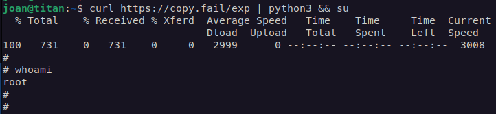
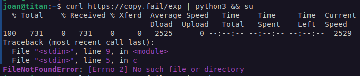

# copy-fail-check
CVE-2026-31431  Helper basado en https://copy.fail/
# Copy Fail Verificación Rápida

Helper interactivo en bash para revisar exposición básica relacionada con **CVE-2026-31431 (Copy Fail)** y aplicar una **mitigación temporal** basada en `algif_aead`.

## Compatibilidad objetivo

Pensado principalmente para:
- Debian / Ubuntu
- AlmaLinux / Rocky / RHEL-like

## ¿Qué hace?

- Muestra sistema operativo, familia y kernel
- Revisa si `algif_aead` está disponible
- Revisa si `algif_aead` está cargado
- Revisa si ya existe el archivo de mitigación
- Sugiere flujo de parcheo según familia (`apt` o `dnf`)
- Permite aplicar mitigación temporal
- Permite revertir la mitigación temporal

## ¿Qué NO hace?

- No confirma al 100% si el sistema ya está parchado solo por versión
- No reemplaza el parcheo de kernel
- No modifica firewall, SSH ni otros servicios ajenos a esta mitigación

## Archivos

- Script principal:
  - `copyfail-tool.sh`
- README:
  - `readme.rd`

## Uso

Dar permisos y ejecutar:

```bash
chmod +x copyfail-tool.sh
./copyfail-tool.sh
```

Para aplicar o revertir mitigación, correrlo con sudo:

```bash
sudo ./copyfail-tool.sh
```

## Opciones del menú

1. Revisar estado
2. Aplicar mitigación temporal
3. Quitar mitigación temporal
4. Acerca de
5. Salir

## Mitigación temporal que aplica

Crea este archivo:

```bash
/etc/modprobe.d/disable-algif.conf
```

Con esta línea:

```bash
install algif_aead /bin/false
```

Y luego intenta:

```bash
rmmod algif_aead
```
## Pantallazos.
Antes de aplicar la mitigación:


Despues de aplicar la mitigación:


## Recomendación importante

Esta herramienta sirve para revisión rápida y contención temporal.
La recomendación principal sigue siendo:

- **parchar kernel cuanto antes**
- para workloads no confiables, considerar también bloqueo de el **AF_ALG** vía seccomp

## Nota

Muchas distribuciones hacen backports de seguridad, por lo que la versión del kernel por sí sola no siempre confirma si ya estás protegido.
